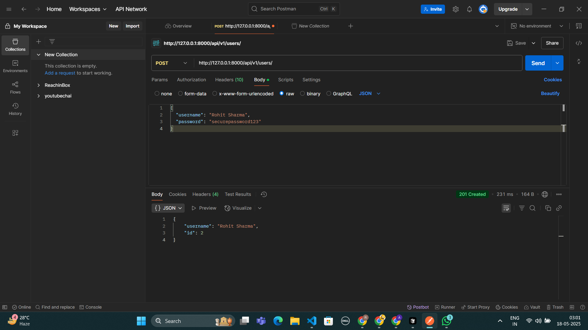
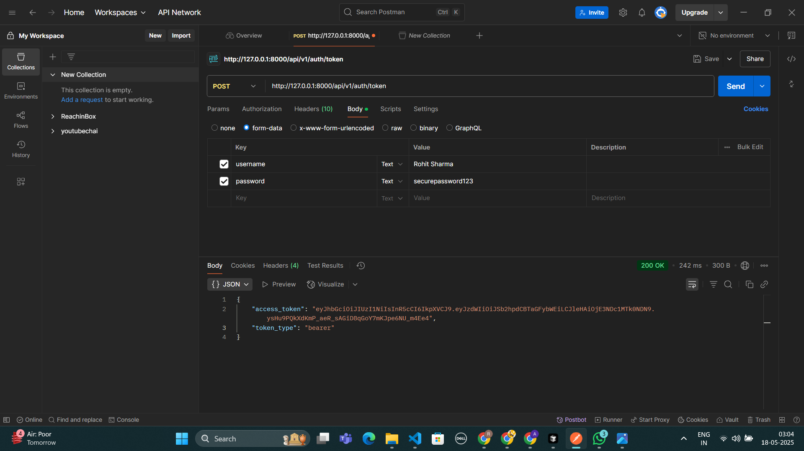
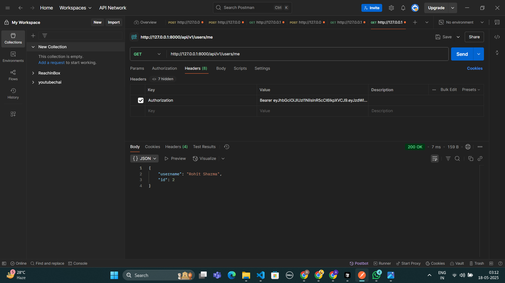
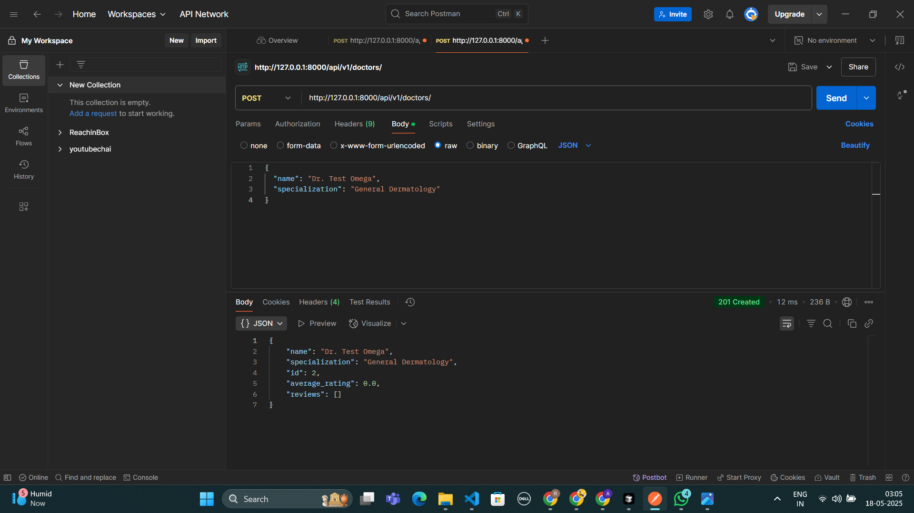
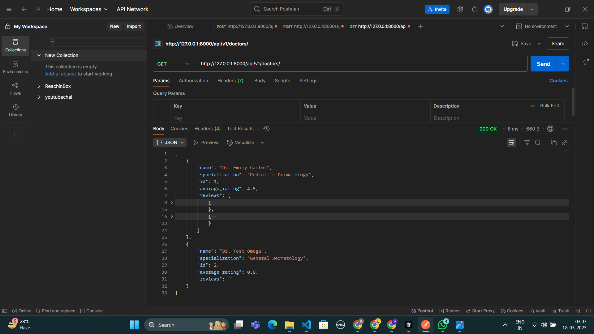
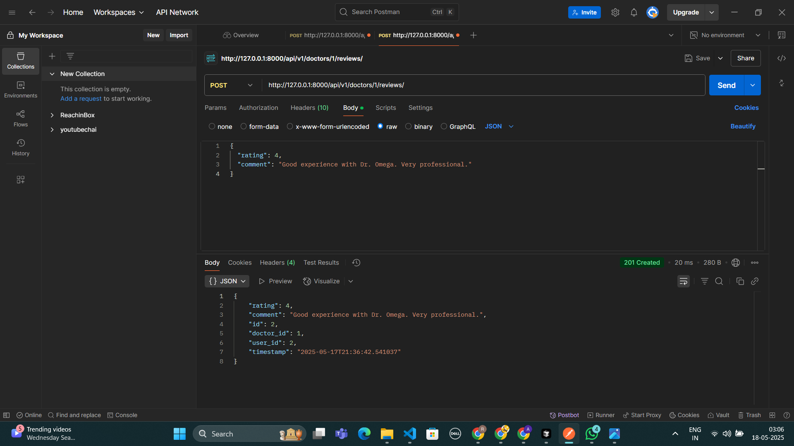
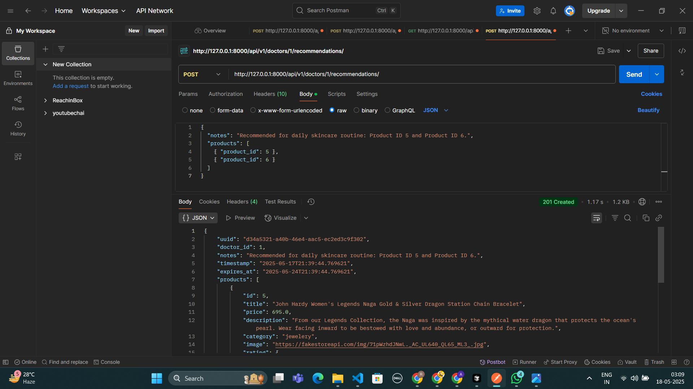
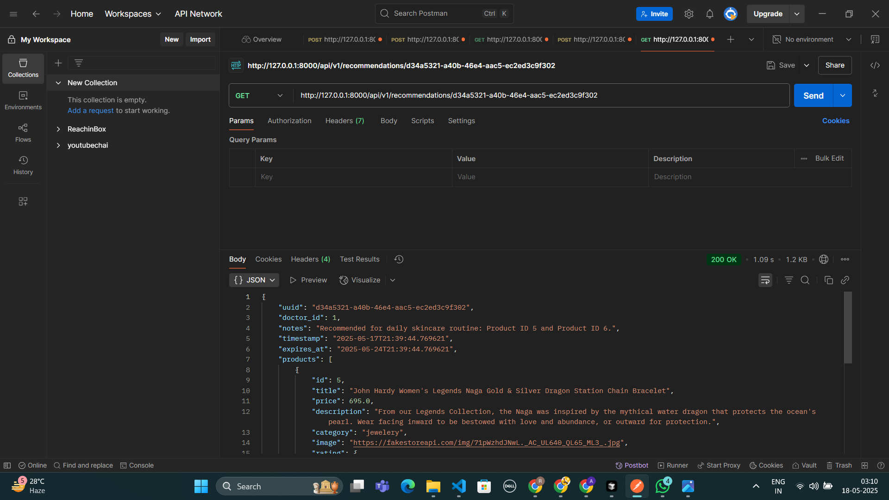
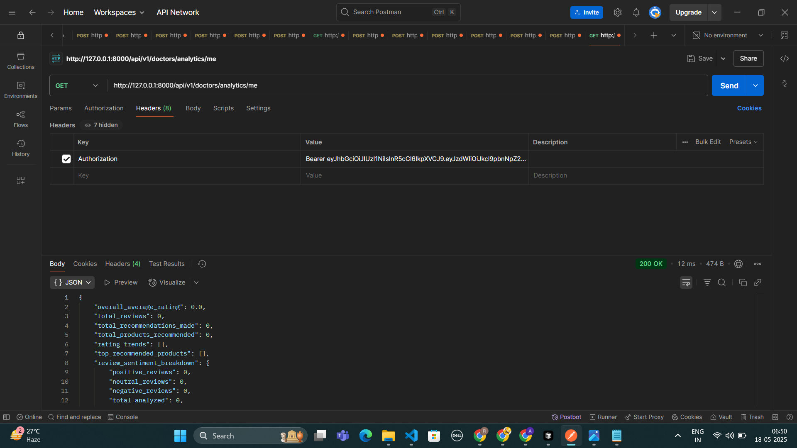

# 🩺 Dermatologist Rating & Recommendation API 🌟

A backend API for a web application enabling customers to rate and review dermatologists, dermatologists to recommend products, and provide an analytics dashboard for dermatologists. Built with Python, FastAPI, and SQLAlchemy.

---

## ✨ Features

### Core Functionality
* 👤 **User Management:** User registration and JWT-based authentication.
* 👨‍⚕️ **Doctor Profiles:** Create and retrieve doctor profiles.
* ⭐ **Rate & Review Doctors:** Authenticated users can submit star ratings (1-5) and textual reviews for dermatologists.
* 📊 **Average Rating:** Doctor profiles display an automatically recalculated average rating.
* 📄 **List Doctors:** Fetch a list of doctors, filterable by minimum rating and with pagination. Results include doctor details, average rating, and reviews.
* 🧴 **Product Recommendations:** Authenticated doctors can recommend a list of products to patients.
* 🔗 **Shareable Recommendation Links:** Generate unique, publicly accessible links for product recommendations (e.g., `/recommendations/{uuid}`). These links fetch product details from an external dummy API.
* ⏳ **Link Expiry:** Recommendation links have a configurable expiry (default 7 days).

### 🚀 Standout Extra Feature: Advanced Analytics Dashboard for Dermatologists
* 📈 **Doctor Analytics (`/api/v1/doctors/analytics/me`):** A dedicated endpoint for authenticated dermatologists to view insights about their profile, including:
    * Overall average rating and total review count.
    * Total number of recommendations made and products recommended.
    * **Rating Trends:** Monthly breakdown of average ratings and number of ratings received.
    * **Top Recommended Products:** List of most frequently recommended products with their titles (fetched from dummy API) and recommendation counts.
    * **Review Sentiment Breakdown:** A basic sentiment analysis (positive, neutral, negative percentages) of their received reviews.
    * *This feature provides valuable B2B insights, enhancing the platform's utility for dermatologist users.*

---

## 🛠️ Tech Stack

* **Language:** Python 3.9+
* **Framework:** FastAPI
* **Database ORM:** SQLAlchemy
* **Database:** SQLite (file-based `test.db` for development stability)
* **Data Validation:** Pydantic
* **Authentication:** JWT (python-jose, passlib)
* **HTTP Client:** `requests` (for fetching external product data)
* **ASGI Server:** Uvicorn

---

## 🚀 Getting Started

### Prerequisites
* Python 3.9 or higher
* `pip` (Python package installer)

### Setup Instructions

1.  **Clone the repository:**
    ```bash
    git clone [https://github.com/Rohit9568/Clinikally-Assignment-Backend.git](https://github.com/Rohit9568/Clinikally-Assignment-Backend.git)
    cd Clinikally-Assignment-Backend
    ```

2.  **Create and activate a virtual environment:**
    ```bash
    # For Windows
    python -m venv venv
    .\venv\Scripts\activate

    # For macOS/Linux
    python3 -m venv venv
    source venv/bin/activate
    ```

3.  **Install dependencies:**
    (Ensure you have a `requirements.txt` file in the repository root.)
    ```bash
    pip install -r requirements.txt
    ```
    Key packages include: `fastapi`, `uvicorn[standard]`, `sqlalchemy`, `pydantic`, `python-jose[cryptography]`, `passlib[bcrypt]`, `requests`.

4.  **Database Setup:**
    * The application uses SQLite with a file-based database named `test.db`.
    * Database tables are automatically created (if they don't exist) when the application starts, thanks to an `on_startup` event handler in `main.py` that calls `Base.metadata.create_all(bind=engine)`.
    * **Important:** If you make changes to the SQLAlchemy models in `app/models.py` (e.g., add a new column), you **must delete the existing `test.db` file** and restart the application to apply schema changes. This ensures a fresh database with the correct structure.

5.  **Run the application:**
    ```bash
    uvicorn app.main:app --reload
    ```
    The API will be available at `http://127.0.0.1:8000`.

---

## 📚 API Documentation & Usage Examples

Interactive API documentation is automatically generated by FastAPI and available at:

* **Swagger UI:** `http://127.0.0.1:8000/docs`
* **ReDoc:** `http://127.0.0.1:8000/redoc`

Below are examples of key API calls (tested with Postman). Replace placeholders like `{{TOKEN}}`, `{{DOCTOR_ID}}`, `{{UUID}}` with actual values obtained during your testing flow.

**(To add screenshots: Save your images in the `screenshots/` folder in this repository. Then replace `your_image_name.png` with the actual filename in the format ``.)**

#### Authentication

* **Register User (`POST /api/v1/users/`)**
    * Request Body: `{ "username": "test_user_alpha", "password": "securepassword123" }`
    * Response: `{ "username": "test_user_alpha", "id": 1 }`

    

* **Login (`POST /api/v1/auth/token`)**
    * Request (form-data): `username: test_user_alpha`, `password: securepassword123`
    * Response: `{ "access_token": "your.jwt.token", "token_type": "bearer" }`

    

#### Users

* **Get Current User (`GET /api/v1/users/me`)**
    * Headers: `Authorization: Bearer {{TOKEN}}`
    * Response: `{ "username": "test_user_alpha", "id": 1 }`

    

#### Doctors

* **Create Doctor Profile (`POST /api/v1/doctors/`)**
    * *Requires authentication. The created doctor profile will be linked to the authenticated user.*
    * Headers: `Authorization: Bearer {{TOKEN}}`
    * Request Body: `{ "name": "Dr. Test Omega", "specialization": "General Dermatology" }`
    * Response: Doctor object including `id`, `average_rating: 0.0`, `reviews: []`.

    

* **Get All Doctors (`GET /api/v1/doctors/`)**
    * Query Params (optional): `min_rating` (float), `skip` (int), `limit` (int)
    * Response: List of doctor objects with details and reviews.

    

* **Get Doctor by ID (`GET /api/v1/doctors/{doctor_id}`)**
    * Response: Single doctor object with details and reviews.

    

#### Reviews

* **Create Review (`POST /api/v1/doctors/{doctor_id}/reviews`)**
    * Headers: `Authorization: Bearer {{TOKEN}}`
    * Request Body: `{ "rating": 4, "comment": "Good experience with Dr. Omega." }`
    * Response: Review object.

    

    *(After reviews are added, calling `GET /api/v1/doctors/` or `GET /api/v1/doctors/{doctor_id}` will show updated average ratings and review lists.)*

    

#### Recommendations

* **Create Recommendation (`POST /api/v1/doctors/{doctor_id}/recommendations`)**
    * Headers: `Authorization: Bearer {{TOKEN}}`
    * Request Body: `{ "notes": "Take twice daily", "products": [{ "product_id": 1 }, { "product_id": 2 }] }`
    * Response: Recommendation object including a `uuid`, `expires_at`, and fetched product details.

    

* **View Recommendation (`GET /api/v1/recommendations/{recommendation_uuid}`)**
    * Response: Publicly accessible recommendation details with fetched product info.

    

#### 🌟 Doctor Analytics (Extra Feature)

* **Get My Analytics (`GET /api/v1/doctors/analytics/me`)**
    * *Requires authentication as a user linked to a doctor profile.*
    * Headers: `Authorization: Bearer {{DOCTOR_USER_TOKEN}}`
    * Example Response Snippet:
        ```json
        {
          "overall_average_rating": 4.5,
          "total_reviews": 10,
          "total_recommendations_made": 5,
          "total_products_recommended": 12,
          "rating_trends": [ { "period": "2025-05", "average_rating": 4.5, "total_ratings": 10 } ],
          "top_recommended_products": [ { "product_id": 1, "product_title": "Product A", "recommendation_count": 5 } ],
          "review_sentiment_breakdown": { /* ... sentiment data ... */ }
        }
        ```

    

---

## 💡 Approach

* **Layered Architecture:** The application is structured into distinct layers (API, CRUD/Services, Models, Schemas) for separation of concerns and better maintainability.
* **FastAPI Framework:** Leveraged for its high performance, asynchronous capabilities (though primarily synchronous for this version's DB logic), Pydantic integration for automatic request/response validation, dependency injection system, and built-in OpenAPI documentation.
* **SQLAlchemy ORM:** Used for database interactions with a SQLite database, abstracting SQL queries into Python objects and methods.
* **Pydantic Models:** Employed for defining clear data schemas, ensuring type validation for API inputs and outputs.
* **JWT Authentication:** Secure stateless authentication is implemented using JSON Web Tokens.
* **Database Choice & Setup:** A file-based SQLite (`test.db`) was chosen for development stability over `sqlite:///:memory:` after encountering lifecycle issues with the latter during auto-reloading. Database tables are initialized via an `on_startup` event.
* **Analytics Feature:** This standout feature was implemented by adding new service functions in `crud.py` to aggregate data (ratings over time, product recommendation counts, basic review sentiment) and exposing it via a secure endpoint (`/api/v1/doctors/analytics/me`) for authenticated dermatologists whose user accounts are linked to their doctor profiles. This significantly enhances the value proposition for dermatologist users.

---

## 🚧 Limitations

* **Database Scalability:** SQLite is a serverless, file-based database, making the current setup best suited for single-node deployments or development. It does not scale horizontally like PostgreSQL or MySQL.
* **Simplified User Roles:** The system uses a generic `User` model. While the analytics endpoint is intended for doctors, there isn't a strict, enforced "Doctor" role at the authentication level beyond the linkage of a `User` account to a `Doctor` profile required for the `/analytics/me` endpoint.
* **Basic Sentiment Analysis:** The review sentiment analysis is very basic (keyword-based) due to the constraint of not using external NLP libraries or services.
* **External API Dependency:** The display of product details in recommendations relies on the availability and consistency of the `fakestoreapi.com` API.
* **Database Migrations:** Schema changes (e.g., adding a column to a model) currently require manual deletion of the `test.db` file for recreation. A production system would use a migration tool like Alembic.
* **Review Idempotency:** A user can currently submit multiple reviews for the same doctor. Business logic for one-review-per-user-per-doctor is not implemented.

---

## 🔮 Future Enhancements

* **Advanced Role-Based Access Control (RBAC):** Implement distinct roles (e.g., Patient, Doctor, Admin) with granular permissions.
* **Sophisticated Sentiment Analysis:** Integrate NLP libraries (e.g., NLTK, spaCy) or cloud services for more accurate review sentiment and insights.
* **Database Migrations:** Introduce Alembic for managing database schema changes without data loss.
* **Scalable Database:** Migrate to a more robust database like PostgreSQL or MySQL for production and scalability.
* **Asynchronous Database Operations:** Refactor CRUD operations to be fully asynchronous for better performance under high I/O load, especially if using an async-compatible database driver.
* **Comprehensive Testing:** Add unit and integration tests for all components and endpoints.
* **Notifications:** Implement notifications (e.g., email, in-app) for new reviews or recommendations.
* **Enhanced Analytics:** Include more detailed analytics, visualizations (if a frontend were added), and filtering options for doctors.
* **Deployment & CI/CD:** Set up a proper deployment pipeline (e.g., Docker, Kubernetes, CI/CD with GitHub Actions).

---

This README aims to provide a comprehensive overview for anyone looking to understand, set up, or contribute to the project.